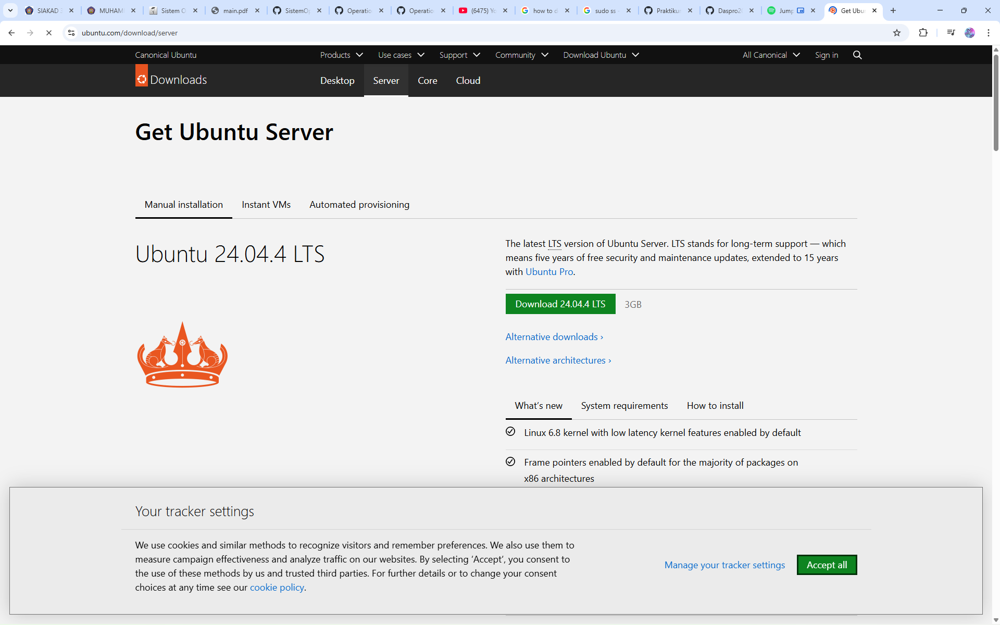
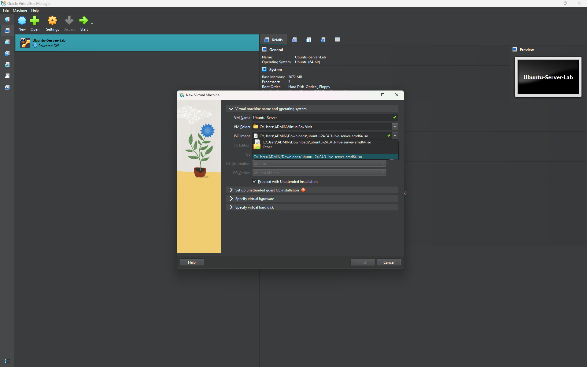
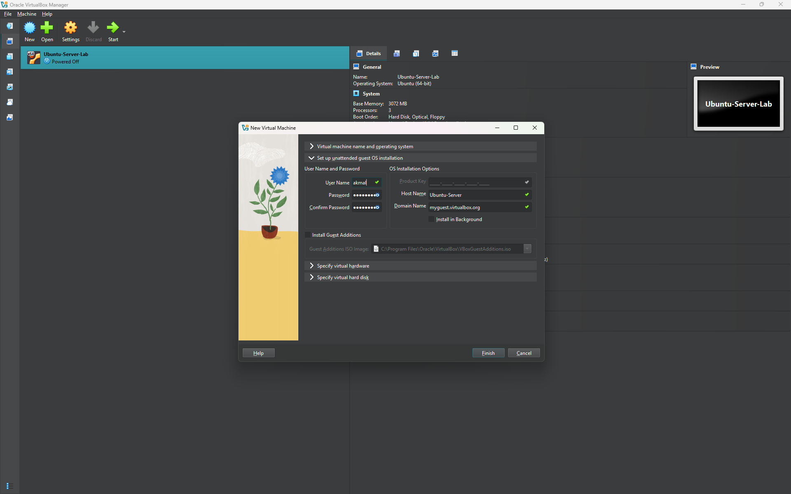
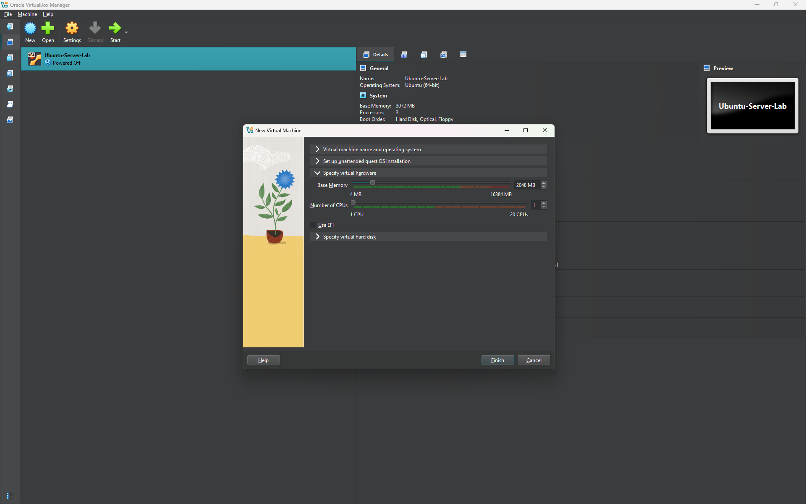
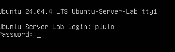

# Laporan Sistem Operasi Jobsheet 1
<h4>Nama : Muhammad Akmal Dwiansyah Putra<h4>
<h4>NIM : 254107020110<h4>
<h4>Kelas : TI_1G<h4>

## 1.10.1. Latihan Konseptual
1. Jelaskan 5 fungsi utama sistem operasi dengan contoh konkret dari minimal 2 OS berbeda (Windows, macOS, atau Linux). 
**jawab:**    
1.Process Management  
<b>Sistem operasi bertanggung jawab untuk:</b>  
• Process scheduling — Menentukan proses mana yang mendapat CPU time  
• Process creation dan termination — Membuat dan mengakhiri proses  
• Process synchronization — Mengkoordinasikan multiple processes  
• Inter-process communication (IPC) — Memfasilitasi komunikasi antar
proses  
<b>Contoh implementasi: </b> 
• Windows: Task Manager menampilkan proses yang berjalan dan penggunaan
sumber daya   
• Linux: Perintah ps, top, dan htop untuk memantau proses  
• macOS: Activity Monitor untuk mengelola proses  
2.Memory Management  
<b>Fungsi memory management meliputi:</b>  
• Memory allocation — Memberikan memori ke proses yang membutuhkan  
• Virtual memory — Menggunakan disk sebagai extension dari RAM  
• Memory protection — Mencegah satu proses mengakses memori proses lain  
• Paging dan swapping — Teknik untuk optimasi penggunaan memori  
3.File Management  
<b>Sistem operasi menyediakan:</b>  
• Organisasi file system — Struktur hirarkis (direktori, subdirektori)
• Operasi file — Membuat, membaca, menulis, menghapus file  
• Kontrol akses — Izin (permissions) untuk keamanan  
• Mounting file system — Mengintegrasikan perangkat penyimpanan ke sistem  
<b>Contoh file systems:</b>  
• Windows: NTFS (New Technology File System)  
• macOS: APFS (Apple File System)  
• Linux: ext4, XFS, Btrfs  
4.I/O Management  
<b>Manajemen Input/Output mencakup:</b>  
• Device drivers — Perangkat lunak untuk berkomunikasi dengan perangkat
keras  
• Buffering — Penyimpanan sementara untuk kelancaran operasi I/O  
• Interrupt handling — Merespon sinyal dari perangkat keras  
• Spooling — Antrean untuk perangkat seperti printer
Security dan Protection  
<b>Contoh Impelentasi:</b>
* Windows: Saat kita memasukkan flashdisk USB, Windows secara otomatis mendeteksi perangkat tersebut dan menggunakan driver yang sesuai (misalnya usbstor.sys) untuk berkomunikasi dengan perangkat keras. Proses ini terjadi di latar belakang tanpa perlu campur tangan pengguna.  
* Linux: Di Linux, ketika perangkat baru seperti printer atau scanner terhubung melalui USB, kernel menggunakan driver seperti usbcore dan usb-storage untuk mengakses perangkat. Pengguna juga bisa melihat daftar driver yang digunakan melalui perintah lsmod atau melihat perangkat di /dev.  
5. Aspek keamanan meliputi:  
• Authentication — Verifikasi identitas pengguna (password, biometrik)  
• Authorization — Kontrol akses ke sumber daya berdasarkan izin (permissions)  
• Encryption — Proteksi data (BitLocker di Windows, FileVault di macOS)  
• Auditing — Pencatatan aktivitas sistem untuk pemantauan keamanan
<b>Contoh Impelemntasi:</b>  
• Windows: Windows memiliki fitur BitLocker yang digunakan untuk mengenkripsi seluruh drive. Misalnya, jika laptop dicuri, data di dalamnya tetap aman karena tidak bisa diakses tanpa kunci pemulihan atau password.  
• Linux: Di Linux, pengguna bisa menggunakan LUKS (Linux Unified Key Setup) untuk enkripsi disk. Saat instalasi Ubuntu, pengguna bisa memilih opsi Encrypt the entire disk untuk melindungi data.
  
2. Kapan sebaiknya menggunakan Windows vs Linux vs macOS? Analisis berdasarkan use case: gaming, development, server, creative work, dan enterprise. 
**jawab:**  
Ketiga Sistem Operasi tersebut memiliki keunikan masing masing dan kegunaan masing masing, untuk user friendly dan compatibility yang besar, windows merupakan Operating System yang layak untuk gaming, presentasi maupun daily-use. Sedangkan linux memiliki kelebihan di customizability, development dan server, dengan bentuk yang sederhana, linux tidak perlu memakan banyak tenaga untuk perangkat seperti laptop. Dan untuk creative work dan enterprise, MacOS merupakan pillihan yang paling bagus dikarenakan memiliki ecosystem yang bagus dibandingkan kedua OS lainnya. Mudah untuk mengirim dan menerima dengan aplikasi seperti apple airdrop. 

## 1.10.2. Latihan Praktikal
Install Ubuntu Server 22.04 LTS di VirtualBox dengan langkah berikut: 
1. Download Ubuntu Server ISO dari website resmi 
2. Create VM baru di VirtualBox (RAM: 2GB, Disk: 25GB) 
3. Install dengan automatic partitioning (guided) 
4. Buat user account dengan password yang kuat 
5. Reboot dan login ke sistem 
6. Dokumentasikan proses instalasi dengan screenshot key steps 

 
 
 
 
 
 

Setelah instalasi Ubuntu Server, lakukan tasks berikut: 
1. Update package list: sudo apt update 
2. Upgrade packages: sudo apt upgrade 
3. Install neofetch: sudo apt install neofetch 
4. Jalankan neofetch dan screenshot hasilnya 
5. Check disk usage dengan df -h 
6. Check memory dengan free -h 
7. Dokumentasikan output dari setiap command 

Eksplorasi sistem yang baru diinstall: 
1. Tampilkan informasi OS: cat /etc/os-release 
2. Tampilkan versi kernel: uname -r 
3. List partisi: lsblk 
4. Check network connectivity: ping -c 4 google.com 
5. Install dan jalankan htop untuk melihat resource usage 
6. Buat laporan singkat tentang konfigurasi sistem Anda 

## 1.10.3. Latihan Refleksi

Ceritakan pengalaman Anda dengan sistem operasi: 
1. Sistem operasi apa yang Anda gunakan sehari-hari? (Windows, macOS, Linux, atau lainnya) 
2. Berapa lama Anda menggunakan sistem operasi tersebut? 
3. Apa yang Anda sukai dari sistem operasi tersebut? 
4. Apa tantangan atau masalah yang pernah Anda hadapi? 
5. Apakah Anda pernah menggunakan sistem operasi lain? Bandingkan pengalaman Anda. 
6. Setelah mempelajari bab ini, apakah ada sistem operasi lain yang ingin Anda coba? Mengapa? 
Tulis refleksi Anda dalam 300-500 kata disertai dengan dokumentasi. 
