# Laporan Sistem Operasi Jobsheet 2
<h4>Nama : Muhammad Akmal Dwiansyah Putra<h4>
<h4>NIM : 254107020110<h4>
<h4>Kelas : TI_1G<h4>

## Praktikum 2.1
1. Melihat informasi CPU
 

2. Melihat Penggunaan Memori
 

3. Informasi DMI
 

**Latihan 2.1** 
Catat: (1) jumlah CPU(s), core/thread, (2) total RAM, (3) total swap. Jelaskan perbedaan RAM vs swap dalam 2–3 kalimat. 
* Cpu = 1  
* threads = 1  
* core = 3  
* RAM = 2.9 Gi  
* swap = 0  
Perbedaan = Perbedaan dari RAM dan swap adalah, RAM merupakan memori utama yang digunakan oleh komputer untuk menyimpan data, sedangkan swap adalah storage yang digunakan sebagai memori virtual cadangan saat RAM mulai penuh 

## Praktikum 2.2
1. Daftar perangkat PCI
 

2.  Melihat driver perangkat PCI
 

3. Mencari info NIC dan drivernya
 

4. Daftar perangkat USB 
 

5. Topologi perangkat USB
 

**Latihan 2.2** 
Temukan 1 perangkat PCI (misal NIC) dan tuliskan: Vendor:Device ID (angka heksadesimal), nama driver/modul kernel, dan deskripsi singkat fungsinya. 

Nama Perangkat = Intel Corporation 82801AA AC'97 Audio Controller 
Device ID = 8086:2415 
Kernel Module = snd_intel8x0 
Deskripsi = Digunakan untuk mengkontrol Audio 

## Praktikum 2.3

1. Melihat block device dan filesystem
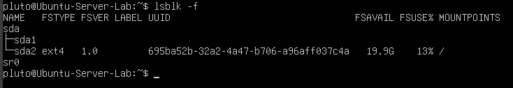 

2. Melihat UUID filesystem
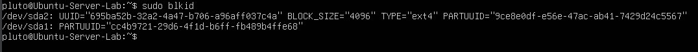 

3. Melihat device untuk root filesystem 
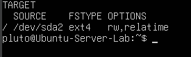 

## Praktikum 2.4

1. Cek versi kernel 
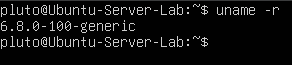 

2. Daftar modul aktif 
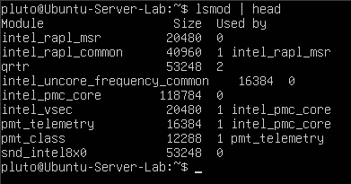 

3. Detail modul dengan modinfo
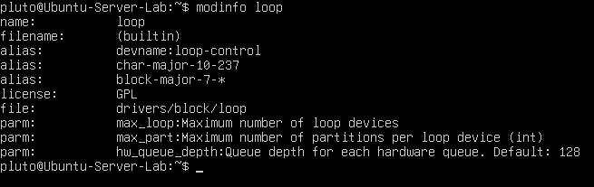 

4. Load modul dan verifikasi 
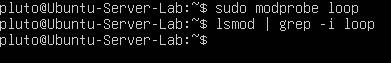 

5. Cek log kernel terbaru 
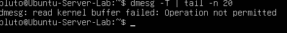 

## Praktikum 2.5

1. Menambahkan modul untuk auto-load (demo)
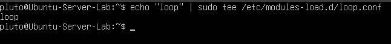 

2. Verifikasi modul aktif 
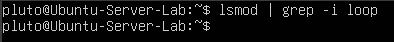 

3. Contoh blacklist modul
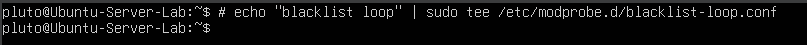 

## Praktikum 2.6

1. Melihat detail device node disk 
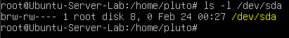 

2. Melihat detail device node terminal 
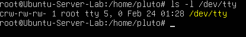 

3. Mapping disk/partisi 
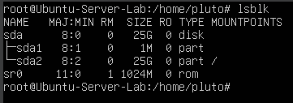 

**Latihan 2.3** 

Dari output ls -l, jelaskan perbedaan penanda file untuk block device dan character device. (Hint: karakter pertama pada permission string) 

Perbedaan = character device memasukkan/mengeluarkan data satu karakter sekaligus, sedangkan block device memasukkan/mengeluarkan data blok demi blok. block device menggunakan tanda huruf b, sedangkan character device menggunakan awalan huruf c 

## Praktikum 2.7

1. Melihat atribut udev untuk disk
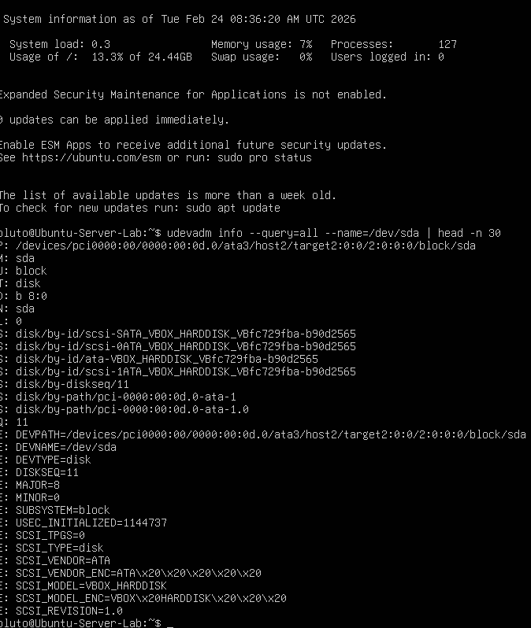 

2. Monitor event udev 
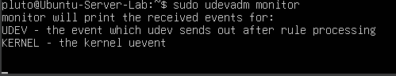 

## Praktikum 2.8

1. Membuat workspace praktikum 
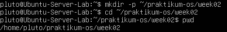 

2. Membuat workspace praktikum
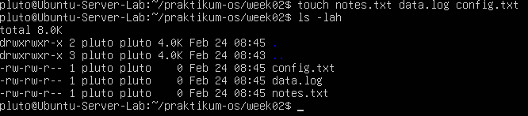 

3.  Mengisi file log contoh
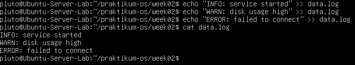 

4. Membaca file dengan less 
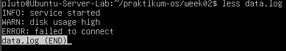 

## Praktikum 2.9

1. grep sederhana 
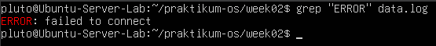 

2. grep case-insensitive 
 

3. grep dengan nomor baris 
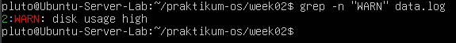 

4. grep invert match 
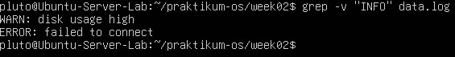 

**Latihan 2.4** 

Gunakan grep untuk menampilkan hanya baris yang mengandung INFO atau
WARN dari data.log. (Hint: gunakan grep -E dengan pola alternatif) 

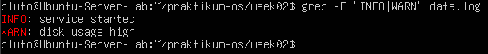 

## Praktikum 2.10

1. Membuat file config latihan 
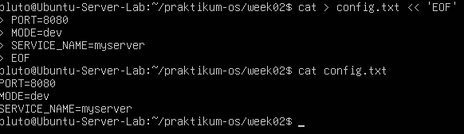 

2. sed substitusi tanpa in-place
 

3. sed in-place
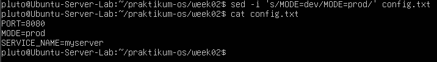 

4. sed global replacement
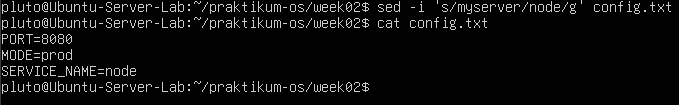 

## Praktikum 2.11

1. Output df -h 
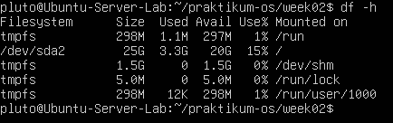 

2. awk print kolom tertentu
 

3. awk filter berdasarkan kondisi
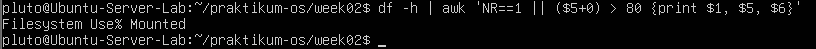 

## Praktikum 2.12

1. ps aux
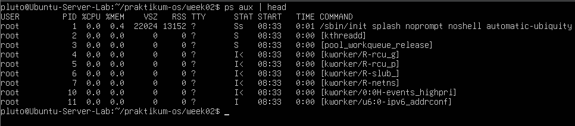 

2. Filter proses dengan grep
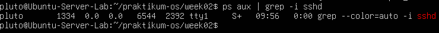 

## Praktikum 2.13

1. Menjalankan top
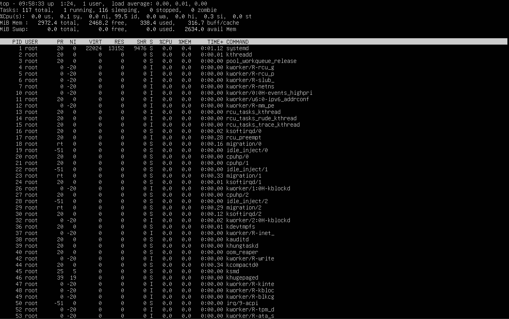 

## Praktikum 2.14

1. Membuat proses dummy
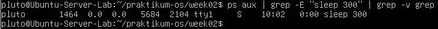 

2. Mencari PID sleep 
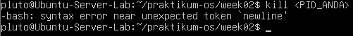 

3. Mengirim SIGTERM
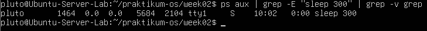 

4. Verifikasi proses sudah berhenti 
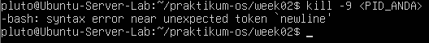 

5. Mengirim SIGKILL  
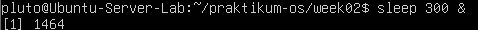 

## Praktikum 2.15

1. Cek kapasitas disk
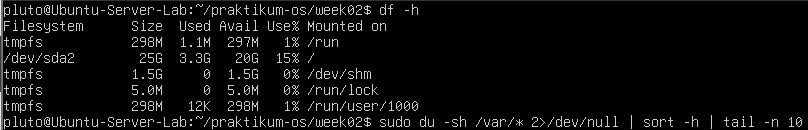 

2. Cek ukuran direktori (contoh /var)
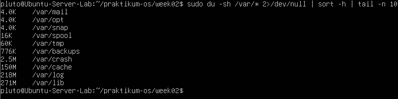 

3. Cek load average 
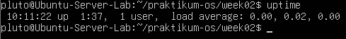 

4. Service yang gagal
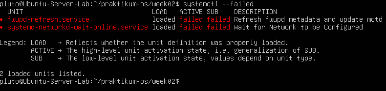 

5. Log error terbaru
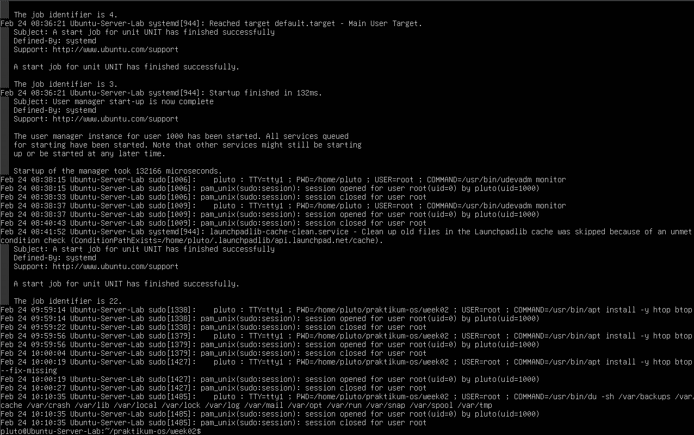 

## Praktikum 2.16

1. Cek IP address
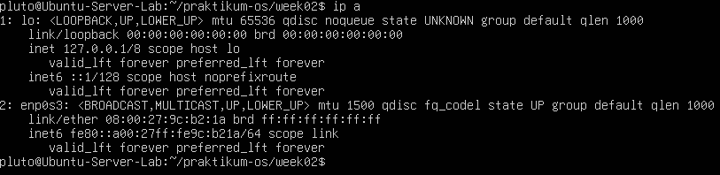 

2. Cek routing
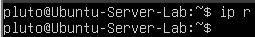 

3. Cek port listening
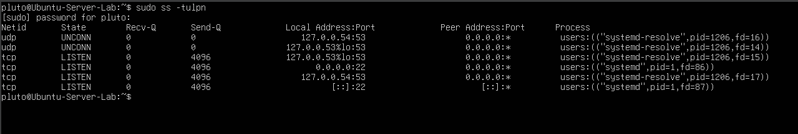 

**Latihan 2.5** 

Pilih satu port yang listening dari output ss -tulpn(misal port 22), lalu tuliskan service/proses yang membukanya. Jelaskan kegunaan port tersebut secara singkat. 

Port = 55 
Proses/Service = systemd 
pid = 1 
Biasanya digunakan untuk: 
- Aplikasi kustom / internal
- Service testing
- Software tertentu yang dikonfigurasi manual
- Bisa juga indikasi service tidak umum (perlu dicek)

# LATIHAN SOAL

2.A Jalankan lspci -nnk. Pilih 1 perangkat PCI dan tuliskan: nama perangkat, ID vendor:device, dan kernel driver in use. 
**jawab:**  
Nama Perangkat = Intel Corporation 82801AA AC'97 Audio Controller 
Device ID = 8086:2415 
Kernel Module = snd_intel8x0 
Deskripsi = Digunakan untuk mengkontrol Audio 
 

2.B Tentukan device root filesystem dengan findmnt /. Lalu cocokkan dengan lsblk -f dan tuliskan tipe filesystem serta UUID-nya. 
**jawab:**  
FileSystem: ext4 
UUID: 695ba52b-32a2-4a47-b706-a96aff037c4a 

2.C Buat file server.log berisi minimal 10 baris dengan variasi kata: INFO,WARN, ERROR. Gunakan grep untuk menampilkan hanya baris ERROR. 
**jawab:**  
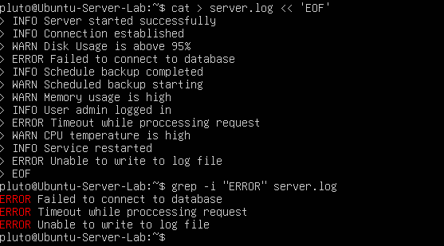 

2.D Gunakan sed untuk mengganti semua kata server menjadi node pada file latihan. Tunjukkan sebelum dan sesudah. 
**jawab:**  
Sebelum 
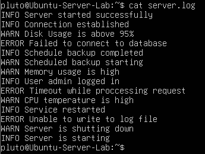 

Sesudah 
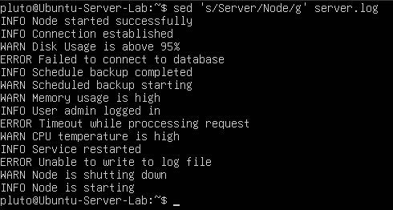 

2.E Gunakan df -h lalu awk untuk menampilkan filesystem yang penggunaan disk di atas 70%. 
**jawab:**  
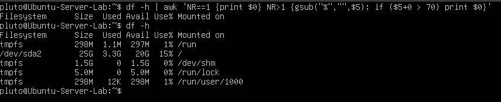 

2.F Jalankan sleep 600 &. Temukan PID-nya dengan ps. Hentikan dengan SIGTERM. Jelaskan beda SIGTERM vs SIGKILL. 
**jawab:**  
Perbedaan dari SIGTERM dan SIGKILL adalah SIGTERM menutup file secara aman, sedangkan SIGKILL memaksa mematikan file yang dapat membuat file tersebut corrupt. Serta SIGTERM menggunakan terminated dan SIGKILL menggunakan killed 

2.G Gunakan systemctl –failed. Jika tidak ada yang gagal, pilih satu service aktif (misal ssh) dan tampilkan status serta 30 baris log terakhirnya. 
**jawab:**  
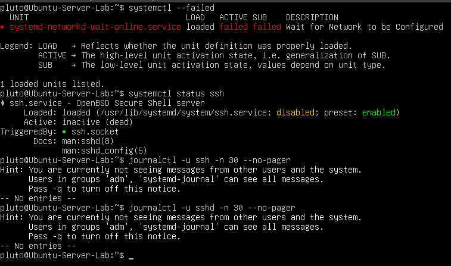 

