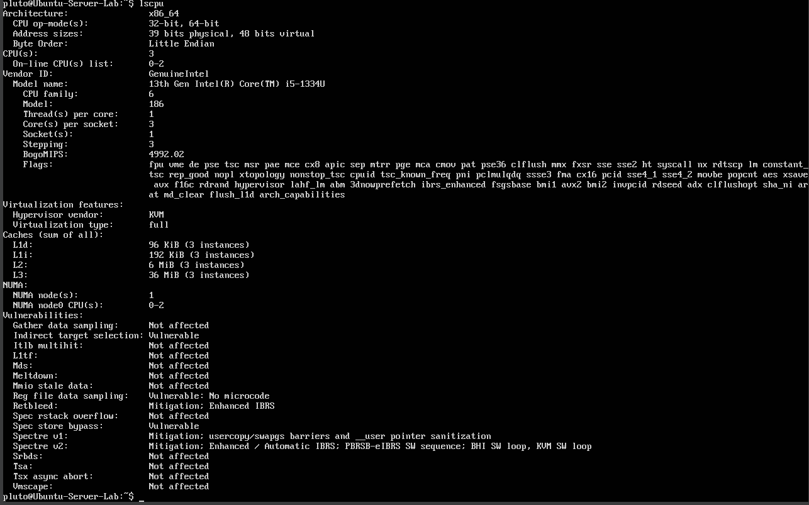
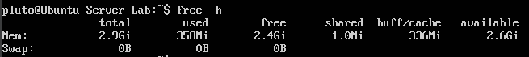
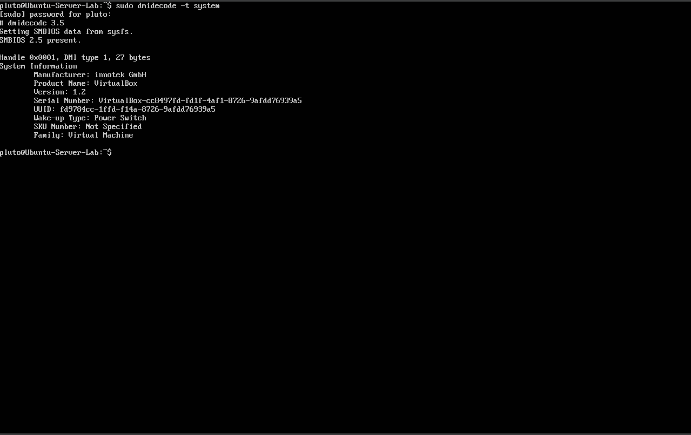
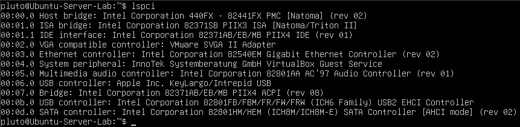
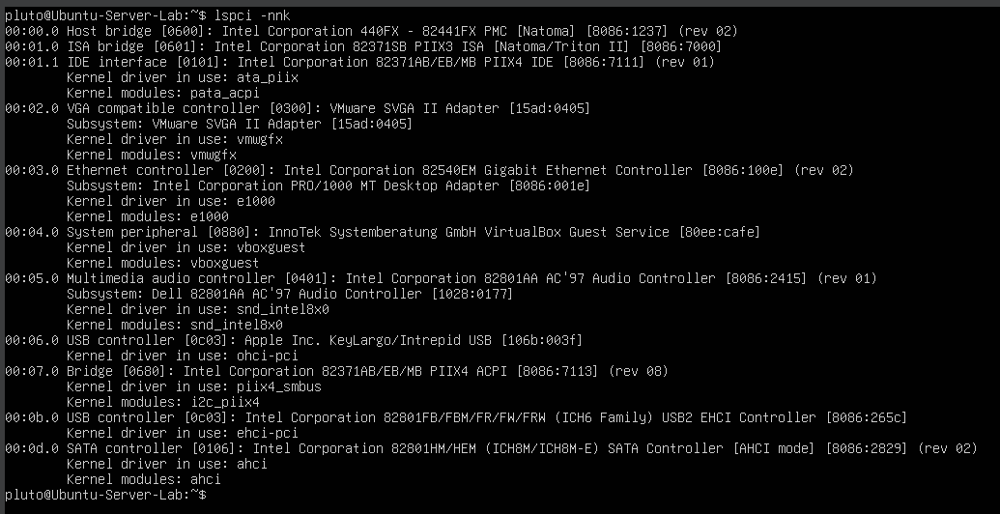
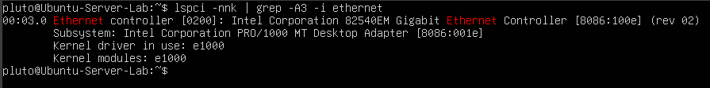
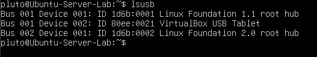
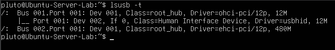

# Laporan Sistem Operasi Jobsheet 2
<h4>Nama : Muhammad Akmal Dwiansyah Putra<h4>
<h4>NIM : 254107020110<h4>
<h4>Kelas : TI_1G<h4>

## Praktikum 2.1
1. Melihat informasi CPU
<break>

2. Melihat Penggunaan Memori
<break>

3. Informasi DMI
<break>

Latihan 2.1 
Catat: (1) jumlah CPU(s), core/thread, (2) total RAM, (3) total swap. Jelaskan perbedaan RAM vs swap dalam 2–3 kalimat.<break>
* Cpu = 1 <break>
* threads = 1 <break>
* core = 3 <break>
* RAM = 2.9 Gi <break>
* swap = 0 <break>
* Perbedaan = Perbedaan dari RAM dan swap adalah, RAM merupakan memori utama yang digunakan oleh komputer untuk menyimpan data, sedangkan swap adalah storage yang digunakan sebagai memori virtual cadangan saat RAM mulai penuh<break>

## Praktikum 2.2
1. Daftar perangkat PCI
<break>

2.  Melihat driver perangkat PCI
<break>

3. Mencari info NIC dan drivernya
<break>

4. Daftar perangkat USB
<break>

5. Topologi perangkat USB
<break>

Praktikum 2
Nama Perangkat = Intel Corporation 82801AA AC'97 Audio Controller
Device ID = 8086:2415
Kernel Module = snd_intel8x0
Deskripsi = Digunakan untuk mengkontrol Audio

Praktikum 6
Perbedaan = character device memasukkan/mengeluarkan data satu karakter sekaligus, sedangkan block device memasukkan/mengeluarkan data blok demi blok. block device menggunakan tanda huruf b, sedangkan character device menggunakan awalan huruf c

Praktikum 16
Port = 55
Proses/Service = systemd
pid = 1
Biasanya digunakan untuk:
-Aplikasi kustom / internal
- Service testing
- Software tertentu yang dikonfigurasi manual
- Bisa juga indikasi service tidak umum (perlu dicek)
